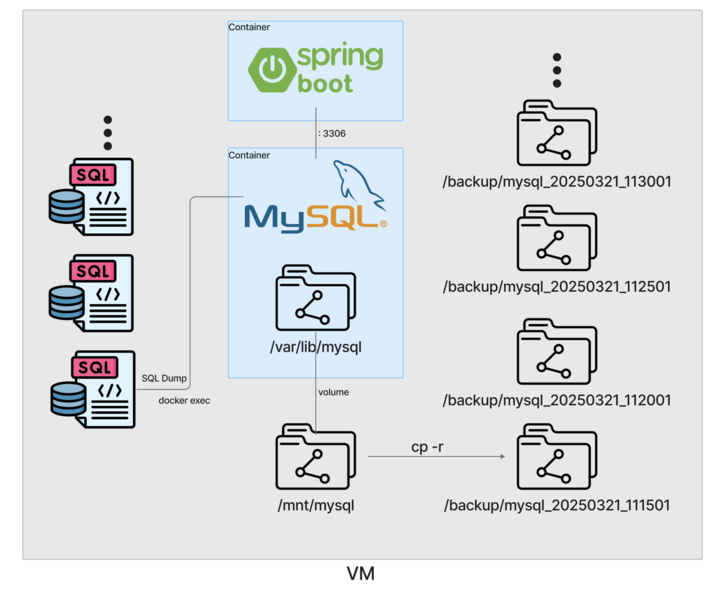
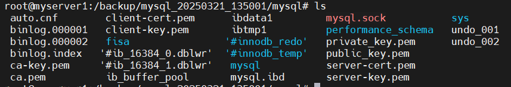
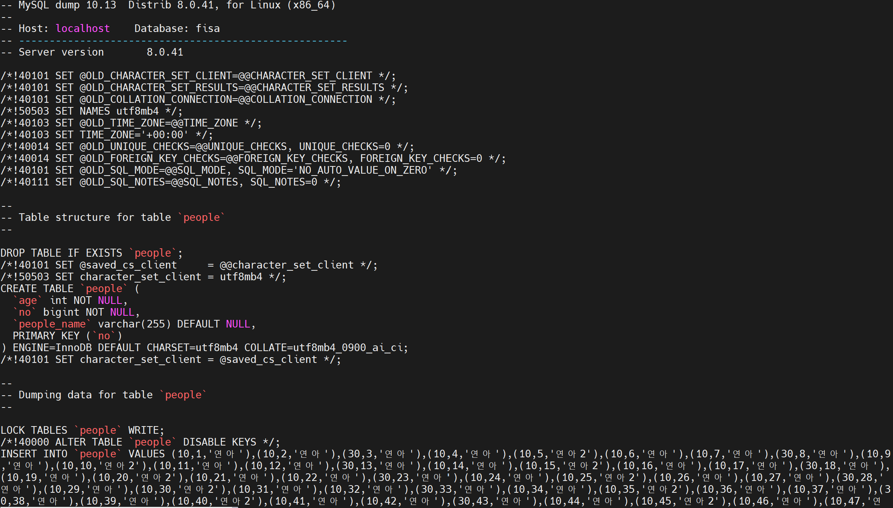
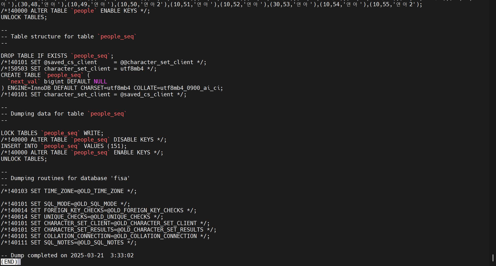

# 🚀 Docker Compose 기반 MySQL 데이터 백업 자동화 프로젝트

**Docker Compose**를 사용해 **MySQL 컨테이너**와 **Spring Boot 애플리케이션**을 함께 실행하고, 일정 주기마다 MySQL 데이터를 백업하도록 자동화하는 과정을 정리합니다.  
개발 및 배포 과정에서 발생할 수 있는 이슈를 최소화하고, 데이터 안정성과 지속 가능성을 강화하기 위해 Docker 및 스크립트를 효율적으로 활용합니다.

---

## 👨‍👨‍👦‍👦 Team

👥 **팀명** : 커닝시티

|||||
|:-:|:-:|:-:|:-:|
|HanJH<br/>[@letsgojh0810](https://github.com/letsgojh0810)|태규<br/>[@EOTAEGYU](https://github.com/EOTAEGYU)|nahong_c<br/>[@HongChan1412](https://github.com/HongChan1412)|Jihoon Kim<br/>[@wild-turkey](https://github.com/wild-turkey)|

---

## 📌 프로젝트 개요
✅ Docker Compose를 사용해 **MySQL 컨테이너**와 **Spring Boot 애플리케이션**을 동시에 실행  
✅ `crontab`을 이용해 일정 주기로 MySQL 데이터를 두 가지 방식으로 백업 및 저장  
✅ `bash script`로 백업 작업 자동화  
✅ 데이터 안정성 강화 및 확장성 확보  

---

## 🎯 주요 기능
✔️ Docker Compose 기반으로 MySQL + Spring Boot 실행 자동화  
✔️ MySQL 데이터 주기적 백업 (폴더 복사 방식 + mysqldump 방식)  
✔️ 백업 상태 모니터링


---
## 📂 프로젝트 구조
```
.
├── backup.sh
├── docker-compose.yaml
├── dockerfile
├── start.sh
└── step06_SpringDataJPA-0.0.1-SNAPSHOT.jar
```
---
## 🧩 프로젝트 아키텍쳐


---

## 1. Docker Compose 기반 MySQL, Spring Boot 실행 자동화
Docker Compose를 통해 MySQL 및 Spring Boot 애플리케이션을 하나의 서비스로 묶어 컨테이너 기반 실행 자동화를 수행합니다.

---

### 🔖 **docker-compose.yaml**
MySQL과 Spring Boot 애플리케이션의 실행 설정을 정의한 파일입니다.

```yaml
version: "1.0"

services:
  db:
    container_name: mysqldb
    image: mysql:8.0
    ports:
      - "3306:3306"
    environment:
      MYSQL_ROOT_PASSWORD: root
      MYSQL_DATABASE: fisa
      MYSQL_USER: user01
      MYSQL_PASSWORD: user01
    networks:
      - spring-mysql-net
    volumes:
      - /mnt/mysql:/var/lib/mysql
    healthcheck:
      test: ['CMD-SHELL', 'mysqladmin ping -h 127.0.0.1 -u root --password=$${MYSQL_ROOT_PASSWORD} || exit 1']
      interval: 10s
      timeout: 2s
      retries: 100

  app:
    container_name: springbootapp
    build:
      context: .
      dockerfile: ./Dockerfile
    ports:
      - "8080:8080"
    environment:
      MYSQL_HOST: db
      MYSQL_PORT: 3306
      MYSQL_DATABASE: fisa
      MYSQL_USER: user01
      MYSQL_PASSWORD: user01
    depends_on:
      db:
        condition: service_healthy
    networks:
      - spring-mysql-net

networks:
  spring-mysql-net:
    driver: bridge
```

> ✅ **MySQL 데이터가 저장될 디렉터리**를 `/mnt/mysql`에 마운트함으로써 컨테이너 재시작 시에도 데이터 유지 가능  

---

### 🔖 **Dockerfile**
Spring Boot 애플리케이션을 빌드하고 실행하는 설정 파일입니다.

```dockerfile
# Java 17 기반 이미지 사용
FROM openjdk:17-jdk-slim

# JAR 파일 추가 및 실행 설정
COPY step06_SpringDataJPA-0.0.1-SNAPSHOT.jar app.jar

# 실행 명령어 설정
ENTRYPOINT ["java", "-jar", "/app.jar"]
```

> ✅ Spring Boot 애플리케이션의 빌드와 배포를 간소화  

---

### 🔖 **start.sh**
필요한 파일이 모두 존재할 경우 Docker Compose로 컨테이너 실행

```bash
#!/bin/bash

# 필수 파일 목록
FILES=("docker-compose.yaml" "dockerfile" "step06_SpringDataJPA-0.0.1-SNAPSHOT.jar")

# 모든 파일이 존재하는지 확인
for file in "${FILES[@]}"; do
    if [[ ! -f "$file" ]]; then
        echo "Error: '$file' not found."
        exit 1
    fi
done

# 파일이 모두 존재하면 docker-compose 실행
echo "All required files are present. Starting Docker Compose..."
docker-compose up -d
```

> ✅ 모든 파일이 존재하는 경우 Docker Compose로 컨테이너 실행  


<br>

## 2. MySQL 데이터 주기적 백업
백업 스크립트와 `crontab`을 통해 일정 주기로 MySQL 데이터를 백업합니다.
1. 볼륨 폴더 전제 복사
2. mysqldump 백업 스크립트

### ✅ 방법 1: 볼륨 폴더 전체 복사 방식


### 🔖 **backup.sh**
MySQL 데이터를 `/backup` 디렉토리에 일정 주기로 저장합니다.

```bash
#!/bin/bash

# 복사 대상 디렉터리 설정
SOURCE_DIR="/mnt/mysql"
DEST_DIR="/backup/mysql_$(date +%Y%m%d_%H%M%S)"

# 백업 디렉터리 생성
mkdir -p "$DEST_DIR"

# 폴더 복사
cp -r "$SOURCE_DIR" "$DEST_DIR"

# 복사 완료 메시지 출력
echo "Backup completed: $DEST_DIR"
```

> ✅ `/mnt/mysql`에서 데이터를 복사해 `/backup/mysql_$(날짜_시간)`에 저장  

---

### 🔖 **crontab 설정**
5분마다 백업 스크립트를 실행하도록 `crontab` 설정

```bash
*/5 * * * * bash /home/ubuntu/06.dockerCompose/backup.sh >> /var/log/backup.log 2>&1
```

> ✅ `5분`마다 실행  
> ✅ 실행 결과를 `/var/log/backup.log`에 저장  

---

### 📂 폴더 백업 결과
```bash
root@myserver1:/backup# ls
mysql_20250321_111501  mysql_20250321_115501  mysql_20250321_123501  mysql_20250321_131501
mysql_20250321_112001  mysql_20250321_120001  mysql_20250321_124001  mysql_20250321_132001
mysql_20250321_112501  mysql_20250321_120501  mysql_20250321_124501  mysql_20250321_132501
mysql_20250321_113001  mysql_20250321_121001  mysql_20250321_125001  mysql_20250321_133001
mysql_20250321_113501  mysql_20250321_121501  mysql_20250321_125501  mysql_20250321_133501
mysql_20250321_114001  mysql_20250321_122001  mysql_20250321_130001  mysql_20250321_134001
mysql_20250321_114501  mysql_20250321_122501  mysql_20250321_130501  mysql_20250321_134501
mysql_20250321_115001  mysql_20250321_123001  mysql_20250321_131001  mysql_20250321_135001
```


## ✅ 방법 2: mysqldump 백업 스크립트 방식

### 🔖 mysql_backup.sh

```
#!/bin/bash
CONTAINER_NAME="mysqldb"
DB_NAME="fisa"
DB_USER="root"
DB_PASSWORD="root"
BACKUP_DIR="/home/ubuntu/mysql_backups"
DATE=$(date +"%Y-%m-%d_%H-%M-%S")

mkdir -p $BACKUP_DIR
docker exec $CONTAINER_NAME mysqldump -u$DB_USER -p$DB_PASSWORD --single-transaction --routines --triggers $DB_NAME > $BACKUP_DIR/${DB_NAME}_backup_${DATE}.sql
gzip $BACKUP_DIR/${DB_NAME}_backup_${DATE}.sql
echo "✅ 백업 완료: $BACKUP_DIR/${DB_NAME}_backup_${DATE}.sql.gz"
```

✅ mysqldump 방식으로 데이터베이스를 SQL 스크립트 형태로 백업 및 압축 저장

### 🔖 crontab 설정 (1분마다 실행)

```
* * * * * bash /home/ubuntu/docker/mysql_backup.sh >> /var/log/mysql_backup.log 2>&1
```

### 🗒️ 파일 백업 결과

#### ✅ .sql.gz 백업 파일 구성
1. 데이터베이스 생성 명령문
2. 테이블 생성 SQL 스크립트
3. 모든 데이터 INSERT 쿼리
4. 인덱스, 트리거, 제약조건 정보
5. (옵션 시) 뷰 및 저장 프로시저 포함

#### 생성되는 백업 파일 목록
```
ubuntu@myserver01:~/mysql_backups$ ls
fisa_backup_2025-03-21_12-0             fisa_backup_2025-03-21_12-32-01.sql.gz  fisa_backup_2025-03-21_13-50-01.sql.gz
fisa_backup_2025-03-21_12-06-01.sql.gz  fisa_backup_2025-03-21_12-33-01.sql.gz  fisa_backup_2025-03-21_13-51-01.sql.gz
fisa_backup_2025-03-21_12-07-01.sql.gz  fisa_backup_2025-03-21_12-34-02.sql.gz  fisa_backup_2025-03-21_13-52-01.sql.gz
fisa_backup_2025-03-21_12-08-01.sql.gz  fisa_backup_2025-03-21_12-35-02.sql.gz  fisa_backup_2025-03-21_13-53-01.sql.gz
...
```

#### 생성된 sqldump 파일



## 🎉 ✅ 백업 방식 비교 요약

|백업 방식|설명|사용 추천 환경|
|---|---|---|
|**볼륨 폴더 복사 방식**|실행 중지 후 물리 폴더 전체 복사|대용량 데이터, 빠른 복원이 필요한 경우|
|**mysqldump 방식**|SQL 스크립트 형태로 백업 및 이식성 높음|무중단 서비스 운영 중, 타 서버 마이그레이션 및 정기 백업 상황에서 권장|


## 🚀 실행
### 1. 도커 컴포즈 실행
```bash
chmod +x start.sh
./start.sh
```

### 2. crontab 설정
```bash
crontab -e
```

#### 2-1. 폴더 복사 백업:
```bash
*/5 * * * * bash /home/ubuntu/06.dockerCompose/backup.sh >> /var/log/backup.log 2>&1
```

#### 2-2. mysqldump 백업:
```bash
* * * * * bash /home/ubuntu/docker/mysql_backup.sh >> /var/log/mysql_backup.log 2>&1
```

### 3. crontab 실행 상태 확인
```bash
crontab -l
```
---


## 📝 고찰
처음에는 컨테이너의 볼륨을 마운트한 폴더를 전체 복사하는 방식으로 백업을 진행했습니다. 하지만 MySQL이 실행 중일 때 폴더 전체를 복사하면 트랜잭션 중간 상태가 포함되어 일관성 문제가 발생할 수 있고, 복원 시 오류가 발생할 위험이 있다는 점을 확인했습니다.

또한, 물리적 폴더 복사 방식은 주기적으로 백업할 경우 스토리지 공간을 매우 빠르게 소모하는 단점이 있었습니다.

최종적으로 mysqldump 방식을 선택하여 주기적으로 SQL 스크립트 형태로 백업하도록 변경했습니다. 이 방식은 백업 파일 크기가 비교적 작고, 다른 환경으로의 이식성과 복원 안정성이 높아 유지 관리 측면에서도 적합하다고 판단했습니다.

### ⚠️ 무중단 물리적 백업 방식
> MySQL의 물리 데이터를 안정적으로 백업하기 위해 **Percona XtraBackup** 또는 **MySQL Enterprise Backup** 과 같은 무중단(Hot Backup) 솔루션을 사용합니다.

#### 1. Percona XtraBackup

- MySQL이 실행 중인 상태에서도 물리적 데이터 파일과 트랜잭션 로그를 안전하게 백업할 수 있도록 설계된 오픈소스 도구입니다.
대규모 데이터베이스 환경에서 무중단 백업과 빠른 복원이 가능하며, 증분 및 차등 백업도 지원합니다.

#### 2. MySQL Enterprise Backup

- Oracle 공식 유료 솔루션으로, 무중단 물리 백업 및 자동 복원 기능을 지원합니다.
고가용성 환경과 금융권 및 대규모 트랜잭션 처리 시스템에서 사용됩니다.

👉 대규모 실무 환경에서는 이러한 전문 백업 솔루션을 통해 일관성과 가용성을 보장하며, 주간 Full 백업 + 일간 증분 백업 조합으로 백업 전략을 구축하는 것이 일반적입니다.


