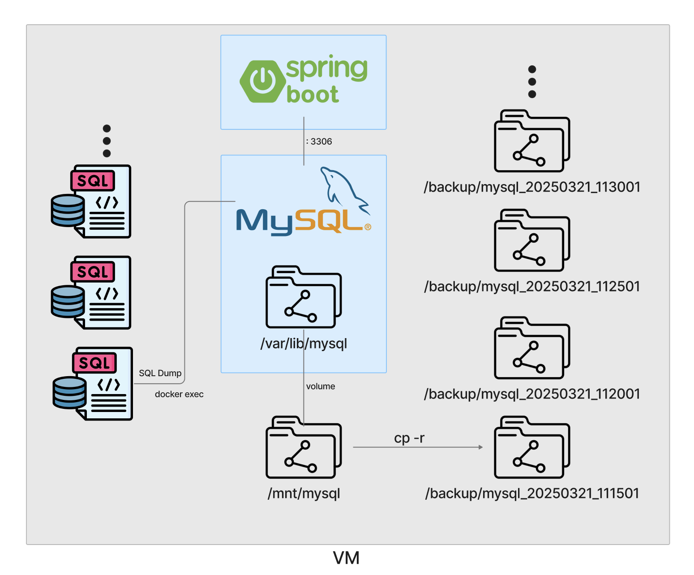

## 🚀 Docker Compose 기반 MySQL 데이터 백업 자동화 프로젝트

이 프로젝트는 **Docker Compose**를 사용해 **MySQL 컨테이너**와 **Spring Boot 애플리케이션**을 함께 실행하고, 일정 주기마다 MySQL 데이터를 백업하도록 자동화하는 과정을 정리합니다.  
개발 및 배포 과정에서 발생할 수 있는 이슈를 최소화하고, 데이터 안정성과 지속 가능성을 강화하기 위해 Docker 및 스크립트를 효율적으로 활용합니다.

---

## 👨‍👨‍👦‍👦 Team

👥 **팀명** : 커닝시티

|||||
|:-:|:-:|:-:|:-:|
|HanJH<br/>[@letsgojh0810](https://github.com/letsgojh0810)|태규<br/>[@EOTAEGYU](https://github.com/EOTAEGYU)|nahong_c<br/>[@HongChan1412](https://github.com/HongChan1412)|Jihoon Kim<br/>[@wild-turkey](https://github.com/wild-turkey)|

---

## 📌 프로젝트 개요
✅ Docker Compose를 사용해 **MySQL 컨테이너**와 **Spring Boot 애플리케이션**을 동시에 실행  
✅ `crontab`을 이용해 일정 주기로 MySQL 데이터를 백업 및 저장  
✅ `bash script`로 백업 작업 자동화  
✅ 데이터 안정성 강화 및 확장성 확보  

---

## 🎯 주요 기능
✔️ Docker Compose 기반으로 MySQL + Spring Boot 실행 자동화  
✔️ MySQL 데이터 정기적 백업 자동화  
✔️ 백업 상태 모니터링 가능  

---
## 📂 프로젝트 구조
```
.
├── backup.sh
├── docker-compose.yaml
├── dockerfile
├── start.sh
└── step06_SpringDataJPA-0.0.1-SNAPSHOT.jar
```
---
## 🧩 프로젝트 아키텍쳐


---

## 1. Docker Compose 기반 실행 자동화
Docker Compose를 통해 MySQL 및 Spring Boot 애플리케이션을 하나의 서비스로 묶어 컨테이너 기반 실행 자동화를 수행합니다.

---

### 🔖 **docker-compose.yaml**
MySQL과 Spring Boot 애플리케이션의 실행 설정을 정의한 파일입니다.

```yaml
version: "1.0"

services:
  db:
    container_name: mysqldb
    image: mysql:8.0
    ports:
      - "3306:3306"
    environment:
      MYSQL_ROOT_PASSWORD: root
      MYSQL_DATABASE: fisa
      MYSQL_USER: user01
      MYSQL_PASSWORD: user01
    networks:
      - spring-mysql-net
    volumes:
      - /mnt/mysql:/var/lib/mysql
    healthcheck:
      test: ['CMD-SHELL', 'mysqladmin ping -h 127.0.0.1 -u root --password=$${MYSQL_ROOT_PASSWORD} || exit 1']
      interval: 10s
      timeout: 2s
      retries: 100

  app:
    container_name: springbootapp
    build:
      context: .
      dockerfile: ./Dockerfile
    ports:
      - "8080:8080"
    environment:
      MYSQL_HOST: db
      MYSQL_PORT: 3306
      MYSQL_DATABASE: fisa
      MYSQL_USER: user01
      MYSQL_PASSWORD: user01
    depends_on:
      db:
        condition: service_healthy
    networks:
      - spring-mysql-net

networks:
  spring-mysql-net:
    driver: bridge
```

> ✅ **MySQL 데이터가 저장될 디렉터리**를 `/mnt/mysql`에 마운트함으로써 컨테이너 재시작 시에도 데이터 유지 가능  

---

### 🔖 **Dockerfile**
Spring Boot 애플리케이션을 빌드하고 실행하는 설정 파일입니다.

```dockerfile
# Java 17 기반 이미지 사용
FROM openjdk:17-jdk-slim

# JAR 파일 추가 및 실행 설정
COPY step06_SpringDataJPA-0.0.1-SNAPSHOT.jar app.jar

# 실행 명령어 설정
ENTRYPOINT ["java", "-jar", "/app.jar"]
```

> ✅ Spring Boot 애플리케이션의 빌드와 배포를 간소화  

---

### 🔖 **start.sh**
필요한 파일이 모두 존재할 경우 Docker Compose로 컨테이너 실행

```bash
#!/bin/bash

# 필수 파일 목록
FILES=("docker-compose.yaml" "dockerfile" "step06_SpringDataJPA-0.0.1-SNAPSHOT.jar")

# 모든 파일이 존재하는지 확인
for file in "${FILES[@]}"; do
    if [[ ! -f "$file" ]]; then
        echo "Error: '$file' not found."
        exit 1
    fi
done

# 파일이 모두 존재하면 docker-compose 실행
echo "All required files are present. Starting Docker Compose..."
docker-compose up -d
```

> ✅ 모든 파일이 존재하는 경우 Docker Compose로 컨테이너 실행  


<br>

## 2. MySQL 데이터 주기적 백업 자동화
백업 스크립트와 `crontab`을 통해 일정 주기로 MySQL 데이터를 백업합니다.

---

### 🔖 **backup.sh**
MySQL 데이터를 `/backup` 디렉토리에 일정 주기로 저장합니다.

```bash
#!/bin/bash

# 복사 대상 디렉터리 설정
SOURCE_DIR="/mnt/mysql"
DEST_DIR="/backup/mysql_$(date +%Y%m%d_%H%M%S)"

# 백업 디렉터리 생성
mkdir -p "$DEST_DIR"

# 폴더 복사
cp -r "$SOURCE_DIR" "$DEST_DIR"

# 복사 완료 메시지 출력
echo "Backup completed: $DEST_DIR"
```

> ✅ `/mnt/mysql`에서 데이터를 복사해 `/backup/mysql_$(날짜_시간)`에 저장  

---

### 🔖 **crontab 설정**
5분마다 백업 스크립트를 실행하도록 `crontab` 설정

```bash
*/5 * * * * bash /home/ubuntu/06.dockerCompose/backup.sh >> /var/log/backup.log 2>&1
```

> ✅ `5분`마다 실행  
> ✅ 실행 결과를 `/var/log/backup.log`에 저장  

---

## 🚀 실행 코드
### 1. 도커 컴포즈 실행
```bash
chmod +x start.sh
./start.sh
```

### 2. crontab 설정
```bash
crontab -e
```
이후 다음 내용 추가:
```bash
*/5 * * * * bash /home/ubuntu/06.dockerCompose/backup.sh >> /var/log/backup.log 2>&1
```

### 3. crontab 실행 상태 확인
```bash
crontab -l
```
---
## 🎉 백업 실행 결과
```bash
root@myserver1:/backup# ls
mysql_20250321_111501  mysql_20250321_115501  mysql_20250321_123501  mysql_20250321_131501
mysql_20250321_112001  mysql_20250321_120001  mysql_20250321_124001  mysql_20250321_132001
mysql_20250321_112501  mysql_20250321_120501  mysql_20250321_124501  mysql_20250321_132501
mysql_20250321_113001  mysql_20250321_121001  mysql_20250321_125001  mysql_20250321_133001
mysql_20250321_113501  mysql_20250321_121501  mysql_20250321_125501  mysql_20250321_133501
mysql_20250321_114001  mysql_20250321_122001  mysql_20250321_130001  mysql_20250321_134001
mysql_20250321_114501  mysql_20250321_122501  mysql_20250321_130501  mysql_20250321_134501
mysql_20250321_115001  mysql_20250321_123001  mysql_20250321_131001  mysql_20250321_135001
```


<!--

---

## 🚧 Troubleshooting
### 🛠️ **Docker Compose 실행 오류 발생 시**
```bash
docker-compose logs
```
→ 오류 내용 확인 후 수정  

### 🛠️ **MySQL 접속 오류 발생 시**
```bash
docker exec -it mysqldb mysql -u root -p
```
→ 비밀번호 입력 후 설정 확인  

### 🛠️ **백업 스크립트 오류 발생 시**
```bash
cat /var/log/backup.log
```
→ 오류 내용 확인  
-->
